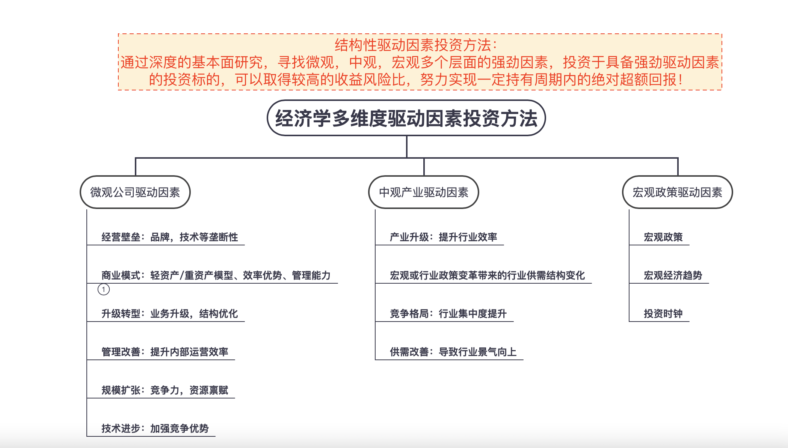
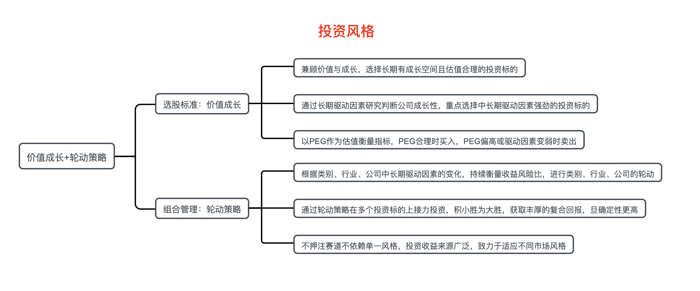
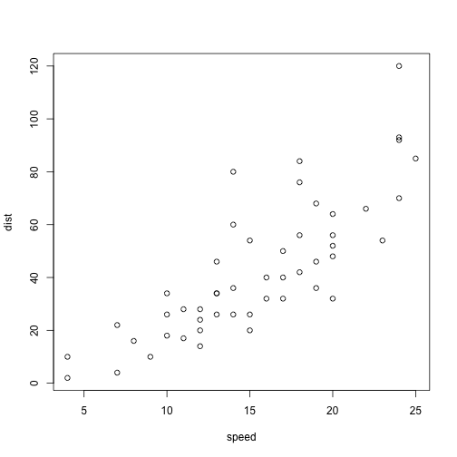

FlyingFox大数据分析体系构建
========================================================
author: LiXin Wu
date: "2022-06-16"
autosize: true


大数据时代投研体系构建
========================================================

 作者 <strong>LIXIN WU</strong> <br/>
 个人网页<https://wulixin.github.io//QuandlFinance//home.html>.<br/>
  <strong>大数据策略：</strong>数据挖掘+数据分析+数据建模+WEB数据可视化<br/>
  <strong>投研模式:</strong>羊群战略+黄金坑战法+龟壳战术<br/>
- <strong>羊群战略</strong>   关于群体的研究<br/>
     （一）基于<strong>聚类算法</strong>的社群分类<br/>
     （二）基于<strong>规则算法</strong>的社群分析<br/>
     （三）基于<strong>反欺诈算法</strong>的异常监控<br/>
- <strong>黄金坑战法</strong>   关于个股的研究<br/>
       针对不同特定场景作战，构建投资策略。<br/>
       (一) 交易策略可视化；<br/>
       (一) 基于<strong>ARIMA时间序列算法</strong>的个股走势预测；<br/>
       (二) 基于<strong>EML超级机器学习算法</strong>的个股走势预测；<br/>
       (三) 基于<strong>NNFOR神经网络算法</strong>的个股走势预测；<br/>
       (四) 基于<strong>MetaAI算法</strong>的个股走势预测；<br/>
       (五) 多维度<strong>量化指标</strong>可视化；<br/>
- <strong>龟壳战术</strong> <br/>
       (一) 测算持有周期，爆发时间节点<br/>
- <strong>个股画像标签体系构建</strong> <br/>
       (一)基于产业经济学的标签体系
- <strong>自动化</strong>生成数据分析报告<br/>
    HTML网页<br/>
    EXCEL/WORD分析报告<br/>

羊群战略阐述
========================================================
   <div style="width:1000px; height:1000px;background-color:lightblue;font-size:40px;">
   <strong>战略高度决定战术优劣</strong>，投资的战略方向选择很重要，物以类聚，人以群分，大部分技术分析，基本面分析人员习惯于盯着一只羊的动作，形态，姿势来判断它的走势，但金融行为学告诉我们，当你发现一只牛股的时候，那在它的附近是存在一群类似的牛股群的，同样对于群体的研究，可以根据头羊风向标的走势，来提前预判个股的动向.因此对于群体的研究有助于我们把握群体的共性跟差异性的个体，同时对于群体存在不同的小团体之间关系的探索，可以帮助我们很好的锁定爆发力最强的群体！</div>
    

投研体系之投研方法
========================================================



投研体系之投研风格
========================================================




二 算法在群体研究中的应用 
========================================================
（一）基于聚类算法的社群分类

- 聚类算法


```
     speed           dist       
 Min.   : 4.0   Min.   :  2.00  
 1st Qu.:12.0   1st Qu.: 26.00  
 Median :15.0   Median : 36.00  
 Mean   :15.4   Mean   : 42.98  
 3rd Qu.:19.0   3rd Qu.: 56.00  
 Max.   :25.0   Max.   :120.00  
```

 （二）基于规则算法的社群分析
========================================================

- 社交网络算法


 （三）基于反欺诈算法的异常监控
========================================================

- 反欺诈算法


```r
summary(cars)
```

```
     speed           dist       
 Min.   : 4.0   Min.   :  2.00  
 1st Qu.:12.0   1st Qu.: 26.00  
 Median :15.0   Median : 36.00  
 Mean   :15.4   Mean   : 42.98  
 3rd Qu.:19.0   3rd Qu.: 56.00  
 Max.   :25.0   Max.   :120.00  
```


机器学习模型
========================================================

- 个股走势预测
- 个股涨跌判别




自动化分析报告
========================================================
    如何每天定时，定期产生标准化的分析报告，大数据时代对于投研时代


