FlyingFox大数据时代股票分析框架构建
========================================================
author: LiXin Wu
date: "2022-06-17"
autosize: true

大数据时代投研体系构建
========================================================

 作者 <strong>LIXIN WU</strong>  
 个人网页<https://wulixin.github.io//QuandlFinance//home.html>. 
  <strong>大数据策略：</strong>数据挖掘+数据分析+数据建模+WEB数据可视化 
  <strong>投研模式:</strong> 从面(群体)————线(小团体)—————点(个体) 
  <strong>投研理论:</strong> 羊群战略+黄金坑战法+龟壳战术 
- <strong>羊群战略</strong>  关于群体的研究 

     （一）全景视图 
     （二）基于<strong>聚类算法</strong>的群体分类 
     （三）基于<strong>规则算法</strong>的群体分析 
     （四）基于<strong>皮尔逊系数</strong>的相关性分析 
     （五）基于<strong>反欺诈算法</strong>的异常监控 
     （六）基于<strong>反欺诈算法</strong>数据可视化 
- <strong>黄金坑战法阐述</strong>   关于个股的研究 

       针对不同特定场景作战，构建投资策略。 
       (一) 交易策略可视化； 
       (二) 基于<strong>ARIMA时间序列算法</strong>的个股走势预测； 
       (三) 基于<strong>ETS模型</strong>的个股走势预测； 
       (四) 基于<strong>NNFOR神经网络算法</strong>的个股走势预测； 
       (五) 基于<strong>MetaAI算法</strong>的个股走势预测； 
       (六) 基于<strong>EML超级机器学习算法</strong>的个股走势预测； 
       (七) 多维度<strong>量化指标</strong>可视化； 
- <strong>龟壳战术阐述</strong>  
- <strong>投研系统</strong>  

       (一)投研方法  
       (二)投研风格  
       (三)投研体系  
       (四)自动化分析报告  
       (五)个股画像标签建设  

羊群战略阐述
========================================================
   

   <strong>战略高度决定战术优劣</strong>，投资的战略方向选择很重要，物以类聚，人以群分，大部分技术分析，基本面分析人员习惯于盯着一只羊的动作，形态，姿势来判断它的走势，但金融行为学告诉我们，当你发现一只牛股的时候，那在它的附近是存在一群类似的牛股群的，同样对于群体的研究，可以根据头羊风向标的走势，来提前预判个股的动向.因此对于群体的研究有助于我们把握群体的共性跟差异性的个体，同时对于群体存在不同的小团体之间关系的探索，可以帮助我们很好的锁定爆发力最强的群体！

群体研究(一)全景视图
========================================================

   以大金融(证券,银行,保险)板块为例
   
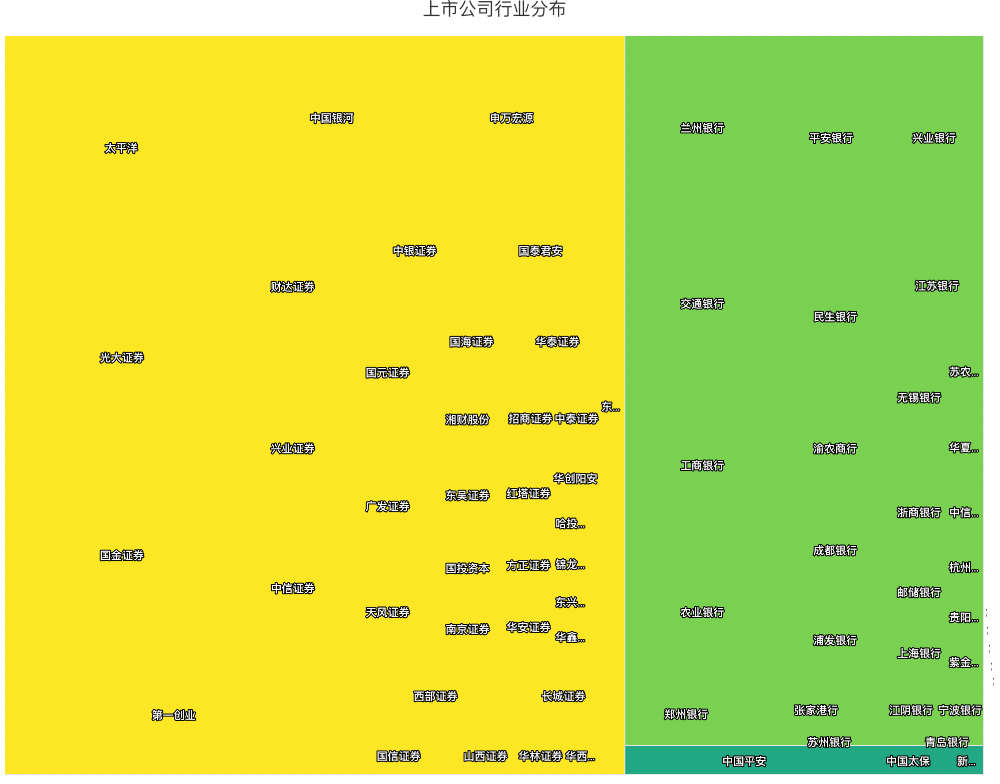

群体研究(二)基于聚类算法的社群分类
========================================================

   以大金融(证券,银行,保险)板块为例
   
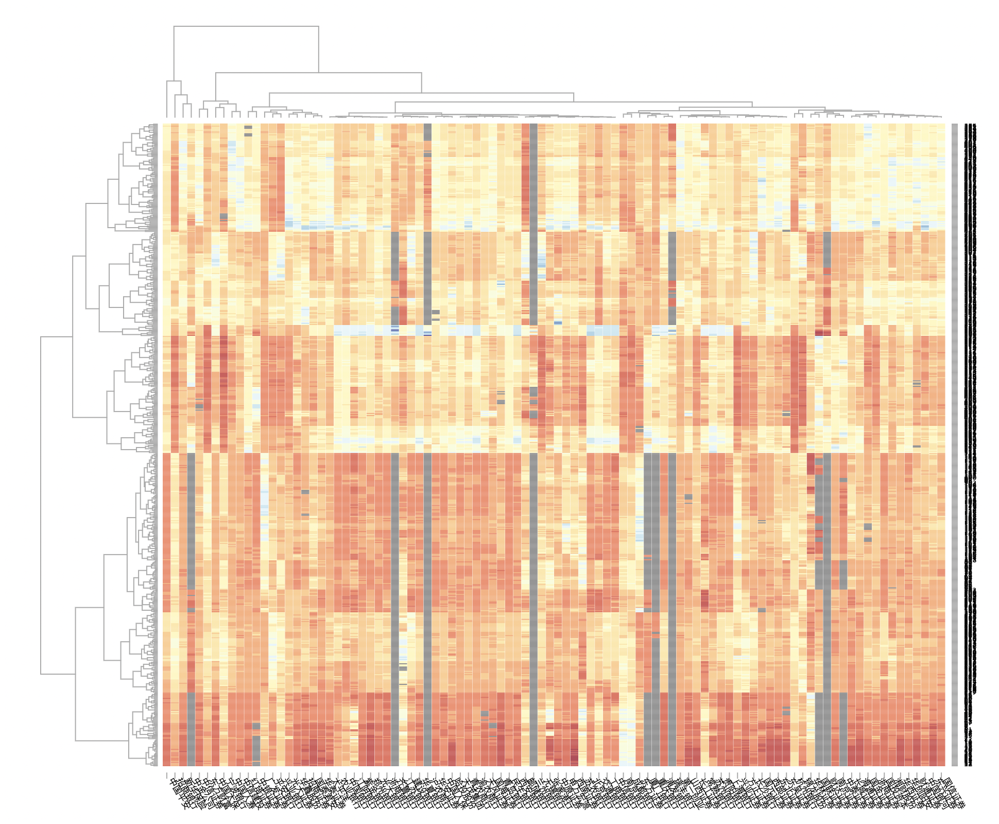

群体研究(三)基于规则算法的社群分析
========================================================
   以大金融(证券,银行,保险)板块为例
   
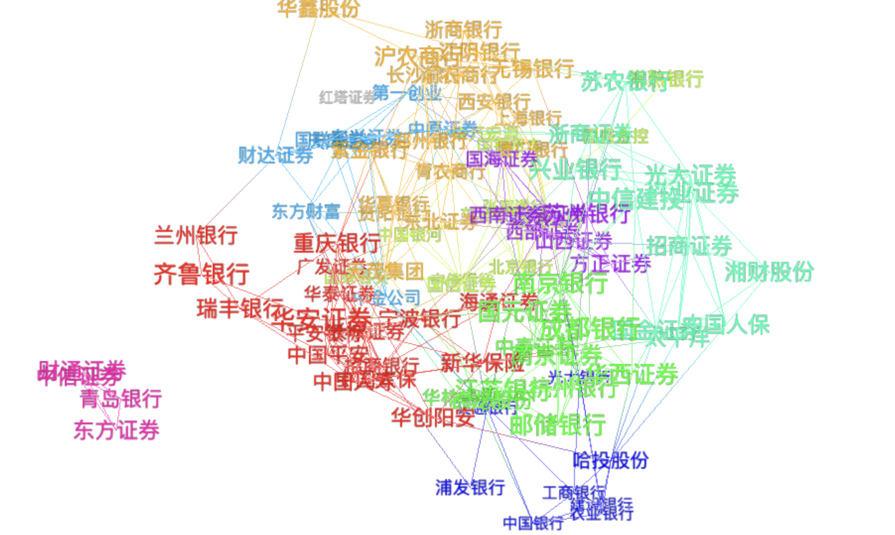

群体研究(四)基于皮尔逊系数的相关性分析
========================================================
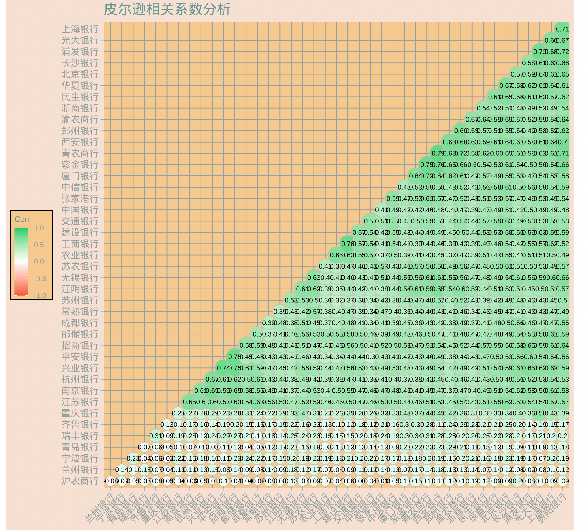

群体研究(五)基于反欺诈算法的异常监控
========================================================
   
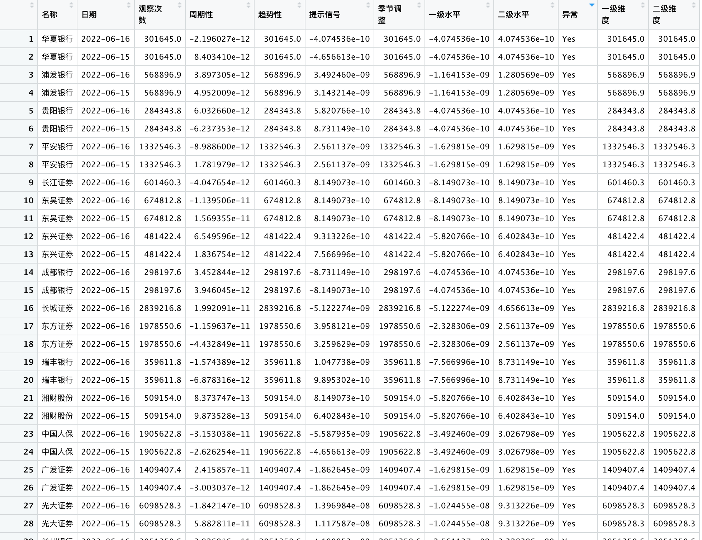

群体研究(六)基于反欺诈算法数据可视化
========================================================
   
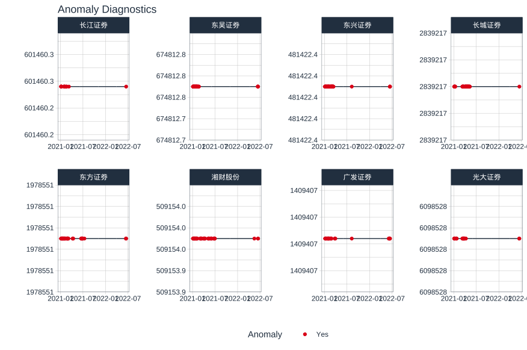

黄金坑战法阐述
========================================================
   

   <strong>首战即决战，一战定乾坤</strong> 如何占据天时人和情况下，选择地利优势，黄金坑底挖黄金！
   孙子曰:昔之善战者，先为不可胜，以待敌之可胜。不可胜在己，可胜在敌。故善战者，
   能为不可胜，不能使敌之必可胜。

   

个股研究(一) 个股交易策略可视化
========================================================

   宁德时代为例
   蓝色为买入线，红色为卖出线，第一次触碰观察，第二次触碰卖出信号；
   
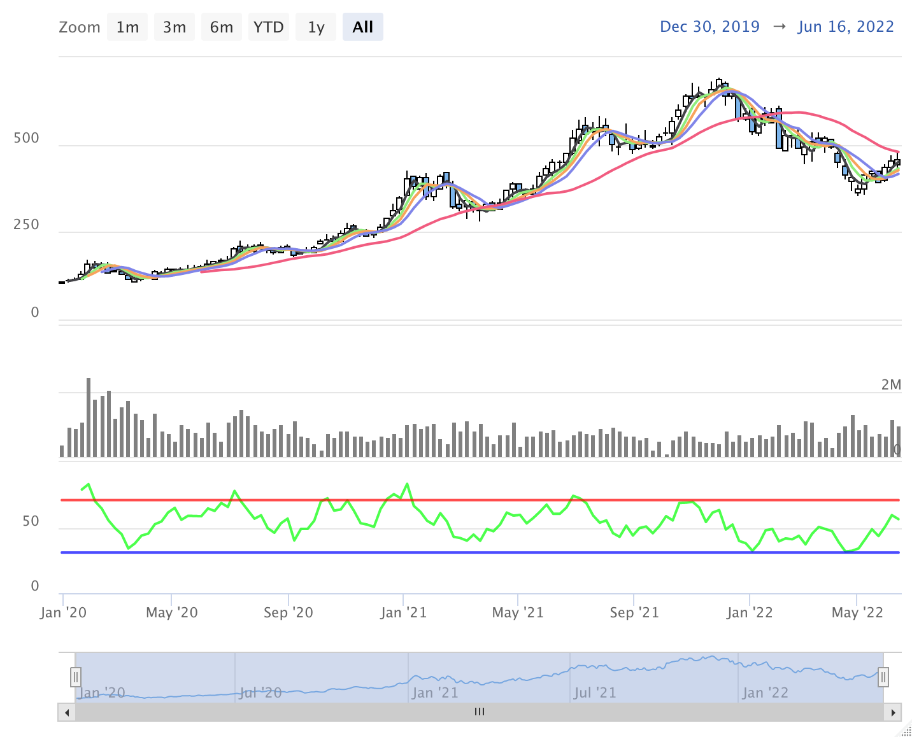

个股研究(二) 基于ARIMA时间序列算法的个股走势预测
========================================================

   宁德时代为例
   
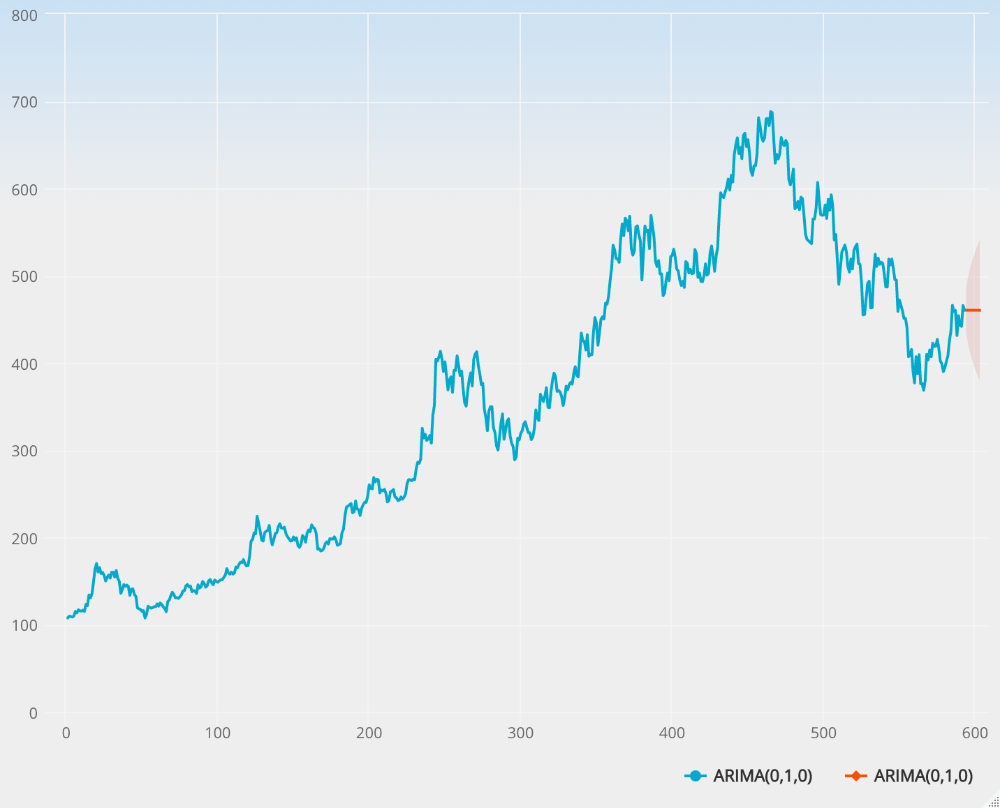

个股研究(三) 基于ETS模型的个股走势预测
========================================================

   宁德时代为例
   
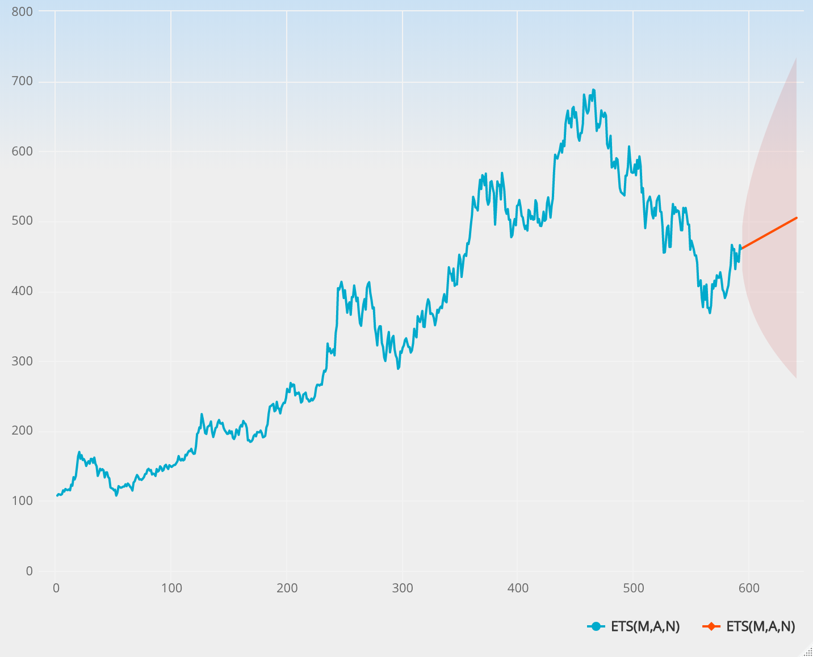

个股研究 (四)基于NNFOR神经网络算法的个股走势预测
========================================================

   宁德时代为例
   
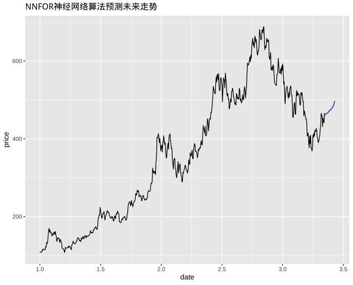

个股研究 (五)基于MetaAI人工智能算法的个股走势预测
========================================================

   宁德时代为例
   
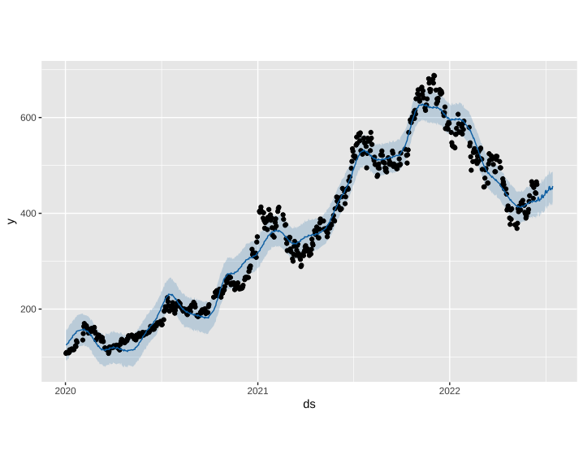

个股研究 (六) 基于EML超级机器学习算法
========================================================

    宁德时代为例
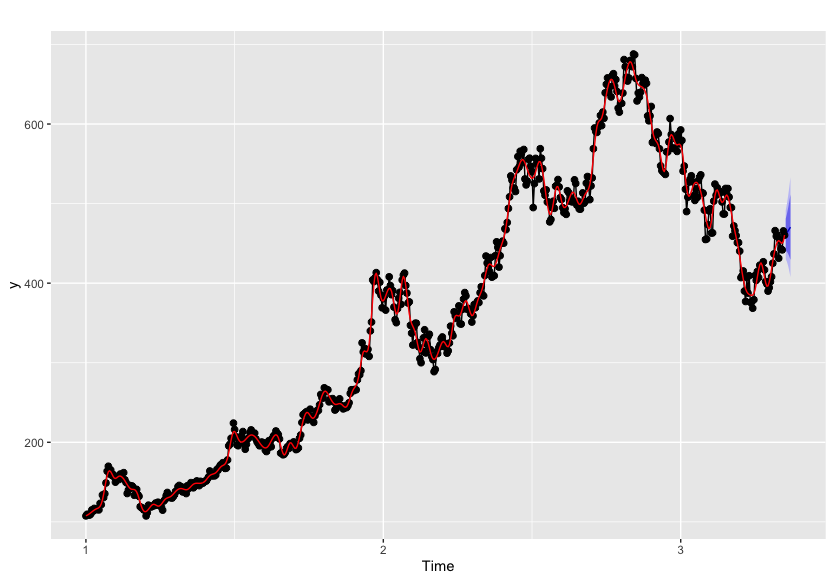

个股研究 (七)多维度量化指标可视化
========================================================

    宁德时代为例
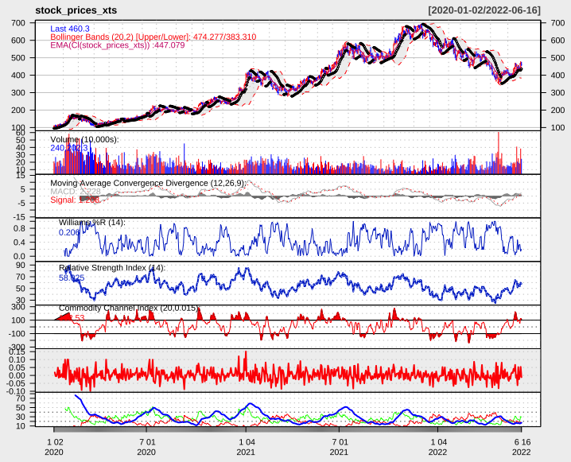

龟壳战术阐述
========================================================
   

   <strong>小战练兵，大战定天下</strong>庄家主力比诸葛亮还狡猾，作为散户，中小投资者，只有充分学习司马懿的坚守之道才能做到百战百胜！百炼成钢！

   
投研系统(一)投研方法
========================================================

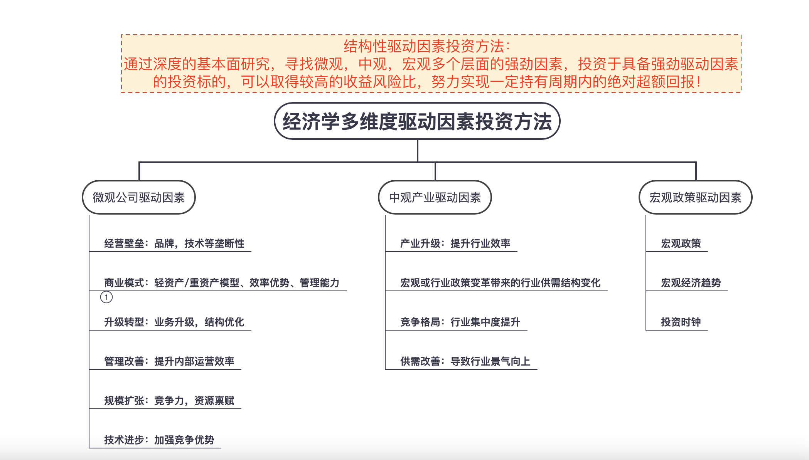

投研系统(二)投研风格
========================================================

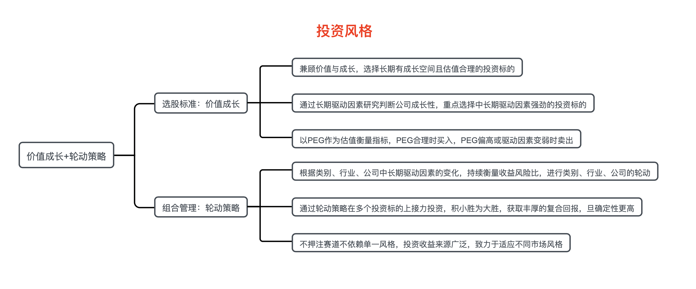

投研系统(三)投研体系
========================================================

投研系统(四)自动化分析报告
========================================================
    如何每天定时，定期产生标准化的分析报告，大数据时代对于投研人员提出了新的要求，随着新股IPO数量不断增加，注定大部分人对于绝大部分新公司是不熟悉不了解，不知道，而资本市场就像城市规划一样，未来拔地而起的高楼，一定是在新的土地上，而不是过去的旧城区！

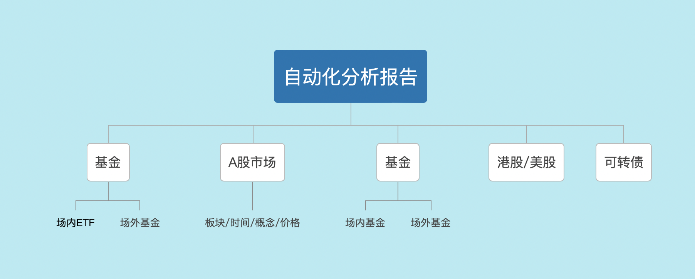

投研系统(五)个股画像标签建设
========================================================
    基于产业经济学的标签类型有助于我们很好的了解投资风向标，投资大趋势，投资画像，寻找类似的标的；
    产业趋势，产业技术，产品类型，产业类型，所处产业链，上下游；
    国内成熟的产业链分析等等，这里不做具体论述；
    
    添加微信了解更多！
 
